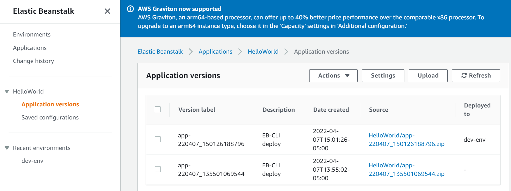
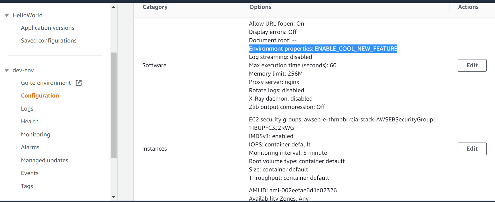
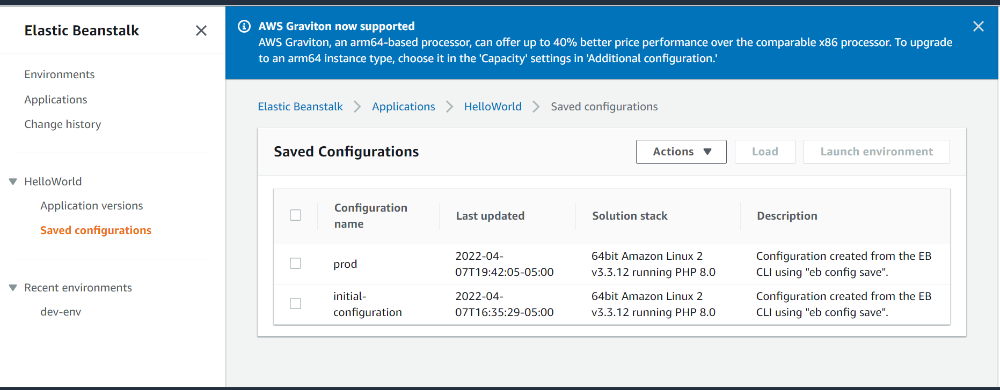
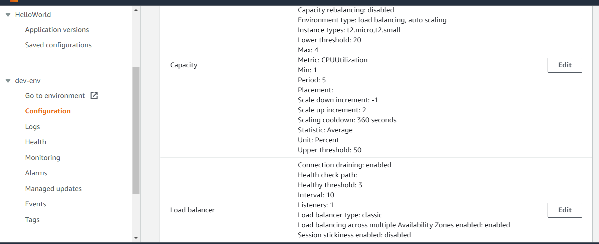

# Configuration Management and Infrastructure as Code

## CloudFormation

### Resources

When you create a resource,   type and properties are required. 

### Outputs

CloudFormation uses Outputs to link two stacks, one stack can reference the value from another stack

First stack: Output component, define **Export name** and value

Second stack: To reference the output from the first stack, using function **fn:ImportValue**, the Export name as the value of the function 

### cfn-init

* cfn-init  (**AWS::CloudFormation::Init**) must be in the Metadata of a resource 

* cfn-init script is run in UserData

* UserData logs go to /var/log/cfn-init.log. 
  * If UserData is defined in cfn-init file, you can get UserData output in log  /var/log/cloud-init-output.log file. 
  * If UserData has been defined in cfn-init file, you can find UserData output in log /var/log/cfn-init.log file. cloud-init-output.log still exists, but UserData output is not in it. 

### cfn-signal and wait conditions

cfn-signal are also is run in UserData

**Wait condition** is a resource. When the wait condition receives the success signal, it will complete the creation. Then the stack goes to the completion stage.

### CloudFormation rollbacks

When you create a stack in the console, you can set **Stack creation option** as enabled or disabled in the **Advanced options**. The default setting is enabled. But if we need to debug the stack creation failure, then we need to change the setting as disabled. 

### CloudFormation - nested stack

```
Resources:
  myStack:
    Type: AWS::CloudFormation::Stack
```

**Note:**

Never make change in the nested stack, but in root stack. 

### CloudFormation Change sets

#### How to create change sets

We can create change sets in 2 ways in AWS console:

* Change sets tab on the left hand side> Click Create change sets button 
* Stack> select the stack you want to create change sets>Action> Create change sets for current stack

####  Change sets outcomes

After you reviewed the change sets, you can choose

* Delete - delete all the updates to the CloudFormation template
* Execute - Update the current CloudFormation template, then the stack

#### Change sets in a stack update

When you update a stack and before you finish the update process, you can view the change sets. 

### CloudFormation - Deploying Lambda functions

#### Lambda Code in the CloudFormation - in line

Lambda code is directly in the CloudFormation template

Good for small piece of code.

Restrictions:

* Maximum 4,000 character

* Cannot have dependencies

#### Lambda Code in the CloudFormation - zipped in S3

Lambda code is not in the CloudFormation template, but zipped and stored in S3. The  S3 location url is in the CloudFormation template. 

Advantage:

* Good for big piece of Lambda code
* Can have dependencies

#### Issue of Lambda function not updated (code zipped in S3) 

**Description:**

A Lambda function code is stored in S3 bucket as my-bucket/my-lambda.zip, we use CloudFormation to deploy the Lambda function. The code has been updated and reload to S3, then run CloudFormation to deploy the Lambda. But the Lambda function was not updated. 

**Solution:**

When you upload the file with same name to S3, it will overwrite the existing file. 

The issue is that CloudFormation does not detect a new file has been uploaded to S3 unless one of these parameters change: 

* S3Bucket
* S3Key
* S3ObjectVersion

### CloudFormation -Customer resources

#### Type and use cases

The type of customer resource starts with **Cutomer**::xxxx. You can use customer resources to do anything. But it can mainly be used for the 4 use cases:

- An AWS resource is yet not covered in CloudFormation (new service for example)
- An On-Premise resource
- Emptying an S3 bucket before being deleted
- Fetch an AMI id

#### Customer resource example - empty S3 bucket 

```
Resources:
  myBucketResource:
    Type: AWS::S3::Bucket

  LambdaUsedToCleanUp:
    Type: Custom::cleanupbucket
    Properties:
      ServiceToken: !ImportValue EmptyS3BucketLambda
      BucketName: !Ref myBucketResource
```

ServiceToken is the Lamba ARN,  imported value from another stack, the Export name is EmptyS3BucketLambda in that stack.

### CloudFormation status code

Need to familiar all status code, most important one is update_rollback_failed

#### UPDATE_ROLLBACK_FAILED state

A stack’s state is set to UPDATE_ROLLBACK_FAILED when CloudFormation cannot roll back all changes during an update.

##### Troubleshoting the failure

* Failed to receive the required number of signals: Use the [signal-resource](https://docs.aws.amazon.com/cli/latest/reference/cloudformation/signal-resource.html) command to manually send the required number of successful signals to the resource that's waiting for them
* Changes to a resource were made outside of AWS CloudFormation: Manually sync resources so that they match the original stack's template
* Insufficient permissions: grant permission
* Invalid security token
* Limitation error: Delete resources that you don't need or request a quota increase
* Resource didn't stabilize: A resource didn't respond because the operation might have exceeded the AWS CloudFormation timeout period or an AWS service might have been interrupted. No change is required.

##### How to resolve a stack in UPDATE_ROLLBACK_FAILED state

After a stack was in the UPDATE_ROLLBACK_FAILED state, you had only **two options**: Delete the stack or contact AWS Support to return the stack to a working state. In many cases (for example, if it is running production workloads), deleting the stack is not an acceptable option.

AWS CloudFormation now offers a **third option: continue update rollback**, which you can initiate from the AWS CloudFormation console or with the **continue-update-rollback** command in the AWS Command Line Interface (CLI). This functionality is enabled for all the stacks in the UPDATE_ROLLBACK_FAILED state.

Depending on the cause of the failure (See **Troubleshooting the failure** above), you can manually fix the error and continue the rollback. By continuing the rollback, you can return your stack to a working state (the `UPDATE_ROLLBACK_COMPLETE` state), and then try to update the stack again. 

##### continue update rollback in CloudFormation console

1. Open the [CloudFormation console](https://console.aws.amazon.com/cloudformation/).

2. From the navigation pane, choose **Stacks**.

3. From the **Stack name** column, select the stack that's stuck in UPDATE_ROLLBACK_FAILED status.

4. If you don't want to skip resources, choose **Stack** **Actions**, and then choose **Continue update rollback**.

-or-

If you want to skip FAILED resources during rollback, complete the following:

1. From the **Stack name** column, select the stack that's stuck in UPDATE_ROLLBACK_FAILED status.

2. Choose **Stack Actions**, and then choose **Continue update rollback**.

3. In the **Continue update rollback** dialog box, expand **Advanced troubleshooting**.

4. In the **Resources to skip - optional** section, select the resources that you want to skip.

5. Choose **Continue update rollback**.

**Reference:**

[Continue Rolling Back an Update for AWS CloudFormation stacks in the UPDATE_ROLLBACK_FAILED state](https://aws.amazon.com/blogs/devops/continue-rolling-back-an-update-for-aws-cloudformation-stacks-in-the-update_rollback_failed-state/)

https://aws.amazon.com/premiumsupport/knowledge-center/cloudformation-update-rollback-failed/

https://docs.aws.amazon.com/AWSCloudFormation/latest/UserGuide/troubleshooting.html#troubleshooting-errors-update-rollback-failed

### CloudFormation - InsufficientCapabilitiesException

This except can be thrown if CloudFormation need to create IAM resources but no assigned capabilities, CAPABILITY_IAM` and `CAPABILITY_NAMED_IAM.

#### CAPABILITY_IAM and CAPABILITY_NAMED_IAM

Some stack templates might include resources that can affect permissions in your AWS account; for example, by creating new AWS Identity and Access Management (IAM) users. For those stacks, you must explicitly acknowledge this by specifying one of these capabilities.

- If you have IAM resources, you can specify either capability.
- If you have IAM resources with custom names, you *must* specify `CAPABILITY_NAMED_IAM`.
- If you don't specify either of these capabilities, AWS CloudFormation returns an `InsufficientCapabilities` error.

### cfn-hup

We can use cfn-hup to update EC2 metadata.

If EC2 metadata change, cfn-hup ensure all the changes will be applied to EC2. 

We can change EC2 instance directly from CloudFormtion without replacing EC2 instance

### CloudFormation - Stack policies

#### What is stack policy

Stack policy defines the resources that you want to protect from unintentional updates during a stack update. It is a json document that  defines the allow/deney update action to the resources. 

#### Stack policy features

* After you set a stack policy, all of the resources in the stack are protected by default. To allow updates on specific resources, you specify an explicit `Allow` statement for those resources in your stack policy. 
* You can define only one stack policy per stack, but, you can protect multiple resources within a single policy.

* It is similar with IAM policy. A stack policy applies only during stack updates. It doesn't provide access controls like an AWS Identity and Access Management (IAM) policy.

* It is in Advanced options in AWS console under CloudFormation.  
* After you apply a stack policy, you can't remove it from the stack, but you can use the AWS CLI to modify it.

#### Stack policy example

```
{
    "Statement": [
        {
            "Effect": "Allow",
            "Action": "Update:*",
            "Principal": "*",
            "Resource": "*"
        },
        {
            "Effect": "Deny",
            "Action": "Update:*",
            "Principal": "*",
            "Resource": "LogicalResourceId/CriticalSecurityGroup"
        },
        {
            "Effect" : "Deny",
            "Action" : "Update:*",
            "Principal": "*",
            "Resource" : "*",
            "Condition" : {
              "StringEquals" : {
                "ResourceType" : ["AWS::RDS::DBInstance"]
              }
            }
        }
    ]
}
```

CriticalSecurityGroup and any DBInstance are not allowed to be changed. 

#### Modifying a stack policy

We need to update the resources if it is not allowed to be updated in stack policy by modifying the stack policy. 

We can perform the modification of stack policy at update time. This will temporarily change the stack policy to allow update the rescource. CloudFormation is going to revert the stack policy as it was after the update. 

## Elastic Beanstalk

### EB CLI

#### EB CLI manual installation

* Open git bash

* Verify that Python and `pip` are both installed correctly by using the following commands.

  ```
  xldu@DESKTOP-HJA61V6 MINGW64 ~
  $ python --version
  Python 3.9.6
  
  xldu@DESKTOP-HJA61V6 MINGW64 ~
  $ pip --version
  pip 22.0.4 from c:\users\xldu\appdata\local\programs\python\python39\lib\site-packages\pip (python 3.9)
  ```

* Install the EB CLI using `pip`.

  ```
  xldu@DESKTOP-HJA61V6 MINGW64 ~
  $ pip install awsebcli --upgrade --user
  ```

* Add the executable path

  To modify your `PATH` variable (Windows):

  1. Press the Windows key, and then enter `environment variables`.
  2. Choose **Edit environment variables for your account**.
  3. Choose **PATH**, and then choose **Edit**.
  4. Add paths to the **Variable value** `C:\users\xldu\AppData\Roaming\Python\Python39\Scripts\`

* Restart a new git bash window

* Verify that the EB CLI is installed correctly.

  ```
  xldu@DESKTOP-HJA61V6 MINGW64 ~
  $ eb --version
  EB CLI 3.20.3 (Python 3.9.6)
  
  ```

**Reference:**

https://docs.aws.amazon.com/elasticbeanstalk/latest/dg/eb-cli3-install-windows.html

#### Create HelloWorld  and deploy it to Elastic Beanstalk using EB CLI

EB CLI in Gitbash: 

##### Step1: Create a project folder, initiate Elastic Beanstalk

**EB command used in this step:**

```
mkdir HelloWorld
cd HelloWorld
eb init
```

**EB CLI:**

```
xldu@DESKTOP-HJA61V6 MINGW64 ~/local-repository/AWS/DOP-C01_Devops_Prof/Configuration_Management (main)
$ mkdir HelloWorld

xldu@DESKTOP-HJA61V6 MINGW64 ~/local-repository/AWS/DOP-C01_Devops_Prof/Configuration_Management (main)
$ cd HelloWorld

xldu@DESKTOP-HJA61V6 MINGW64 ~/local-repository/AWS/DOP-C01_Devops_Prof/Configuration_Management/HelloWorld (main)
$ eb init
```

**Make selections for eb init:**

Region: us-east-1

Application name: default, the same as directory name, enter

Platform: PHP

Platform branch: latest version as default, PHP 8.0 running on 64bit Amazon Linux 2x, enter

SSH Keypair: Yes, Devkeypair

**elasticbeanstalk and config.yml**:

Now, a `.elasticbeanstalk` folder has created under directory HelloWorld, and `config.yml` has been created in `.elasticbeanstalk` folder.

**Below are content of config.yml file:**

```
branch-defaults:
  default:
    environment: dev-env
    group_suffix: null
global:
  application_name: HelloWorld
  branch: null
  default_ec2_keyname: Devkeypair
  default_platform: PHP 8.0 running on 64bit Amazon Linux 2
  default_region: us-east-1
  include_git_submodules: true
  instance_profile: null
  platform_name: null
  platform_version: null
  profile: null
  repository: null
  sc: null
  workspace_type: Application
```

##### Step 2: Add index.html and deploy the application to EB

**EB command used in this step:**

```
echo "Hello World" > index.html
eb create dev-env
```

**EB CLI:**

```
xldu@DESKTOP-HJA61V6 MINGW64 ~/local-repository/AWS/DOP-C01_Devops_Prof/Configuration_Management/HelloWorld (main)
$ echo "Hello World" > index.html
xldu@DESKTOP-HJA61V6 MINGW64 ~/local-repository/AWS/DOP-C01_Devops_Prof/Configuration_Management/HelloWorld (main)
$ eb create dev-env
Creating application version archive "app-220407_135501069544".
Uploading HelloWorld/app-220407_135501069544.zip to S3. This may take a while.
Upload Complete.
Environment details for: dev-env
  Application name: HelloWorld
  Region: us-east-1
  Deployed Version: app-220407_135501069544
  Environment ID: e-thmbbrreia
  Platform: arn:aws:elasticbeanstalk:us-east-1::platform/PHP 8.0 running on 64bit Amazon Linux 2/3.3.12
  Tier: WebServer-Standard-1.0
  CNAME: UNKNOWN
  Updated: 2022-04-07 18:55:05.410000+00:00
Printing Status:
2022-04-07 18:55:03    INFO    createEnvironment is starting.
2022-04-07 18:55:05    INFO    Using elasticbeanstalk-us-east-1-745361488260 as Amazon S3 storage bucket for environment data.
2022-04-07 18:55:32    INFO    Created security group named: sg-08c92983fa5978356
2022-04-07 18:55:47    INFO    Created load balancer named: awseb-e-t-AWSEBLoa-1BL95F1FUNMH1
2022-04-07 18:55:47    INFO    Created security group named: awseb-e-thmbbrreia-stack-AWSEBSecurityGroup-1IBUPFC3J2RWG
2022-04-07 18:56:04    INFO    Created Auto Scaling launch configuration named: awseb-e-thmbbrreia-stack-AWSEBAutoScalingLaunchConfiguration-hPdnFoTdNszA
2022-04-07 18:56:51    INFO    Created Auto Scaling group named: awseb-e-thmbbrreia-stack-AWSEBAutoScalingGroup-U53NS9NCV57I
2022-04-07 18:56:51    INFO    Waiting for EC2 instances to launch. This may take a few minutes.
2022-04-07 18:57:06    INFO    Created Auto Scaling group policy named: arn:aws:autoscaling:us-east-1:745361488260:scalingPolicy:b033b3a3-504e-487e-af44-3e0a037f911b:autoScalingGroupName/awseb-e-thmbbrreia-stack-AWSEBAutoScalingGroup-U53NS9NCV57I:policyName/awseb-e-thmbbrreia-stack-AWSEBAutoScalingScaleUpPolicy-ADCU8B52CZFB
2022-04-07 18:57:06    INFO    Created Auto Scaling group policy named: arn:aws:autoscaling:us-east-1:745361488260:scalingPolicy:aea6d1b6-828a-4513-963e-c4ea9410bd56:autoScalingGroupName/awseb-e-thmbbrreia-stack-AWSEBAutoScalingGroup-U53NS9NCV57I:policyName/awseb-e-thmbbrreia-stack-AWSEBAutoScalingScaleDownPolicy-14KH58NEHDS7R
2022-04-07 18:57:06    INFO    Created CloudWatch alarm named: awseb-e-thmbbrreia-stack-AWSEBCloudwatchAlarmHigh-23B0M2NGD32K
2022-04-07 18:57:06    INFO    Created CloudWatch alarm named: awseb-e-thmbbrreia-stack-AWSEBCloudwatchAlarmLow-1HBZEFBF8JHJK
2022-04-07 18:57:10    INFO    Instance deployment: You didn't include a 'composer.json' file in your source bundle. The deployment didn't install Composer dependencies.
2022-04-07 18:57:13    INFO    Instance deployment completed successfully.
2022-04-07 18:57:44    INFO    Application available at dev-env.eba-3iycvrr3.us-east-1.elasticbeanstalk.com.
2022-04-07 18:57:45    INFO    Successfully launched environment: dev-env
```

As soon as I entered `eb create dev-env`, it is going to zipup the content in my directory and upload to Elastic Beanstalk, and create dev environment. 

When you go to Elastic Beanstalk console, you can see the application.

##### Step 3: test the application

`eb open` to access the web application 

```
xldu@DESKTOP-HJA61V6 MINGW64 ~/local-repository/AWS/DOP-/Configuration_Management/HelloWorld (main)
$ eb open
```

#### Important EB commands

##### eb status

`eb status`: Show the status of the application, HelloWorld application status is ready, health is green.

```
xldu@DESKTOP-HJA61V6 MINGW64 ~/local-repository/AWS/DOP-C01_Devops_Prof/Configuration_Management/HelloWorld (main)
$ eb status
Environment details for: dev-env
  Application name: HelloWorld
  Region: us-east-1
  Deployed Version: app-220407_135501069544
  Environment ID: e-thmbbrreia
  Platform: arn:aws:elasticbeanstalk:us-east-1::platform/PHP 8.0 running on 64bit Amazon Linux 2/3.3.12
  Tier: WebServer-Standard-1.0
  CNAME: dev-env.eba-3iycvrr3.us-east-1.elasticbeanstalk.com
  Updated: 2022-04-07 18:57:45.097000+00:00
  Status: Ready
  Health: Green
```

##### eb health

`eb health` and `eb health --refresh` : Show the overall health of all the instances. 

`eb health --refresh`  refreshes the result every 10 seconds. It is equivalent to the **Health** tab under dev-env in AWS console.

```
xldu@DESKTOP-HJA61V6 MINGW64 ~/local-repository/AWS/DOP-C01_Devops_Prof/Configuration_Management/HelloWorld (main)
$ eb health

 dev-env                         Ok                         2022-04-07 14:47:02
WebServer                        PHP 8.0 running on 64bit Amazon Linux 2/3.3.12
  total      ok    warning  degraded  severe    info   pending  unknown
    1        1        0        0        0        0        0        0

  instance-id           status     cause                               health
    Overall             Ok
  i-03e7bd7b36f2ea4eb   Ok

  instance-id           r/sec    %2xx   %3xx   %4xx   %5xx      p99      p90
    Overall             0.0         -      -      -      -         -        -       -       -       -
  i-03e7bd7b36f2ea4eb   0.0         -      -      -      -         -        -       -       -       -

  instance-id           type       az   running     load 1  load 5      user %
  i-03e7bd7b36f2ea4eb   t2.micro   1b   51 mins        0.0     0.0         0.0     0.0       0.0   100.0        0.0

  instance-id           status     id   version                   ago
  i-03e7bd7b36f2ea4eb   Deployed   1    app-220407_135501069544   49 mins


xldu@DESKTOP-HJA61V6 MINGW64 ~/local-repository/AWS/DOP-C01_Devops_Prof/Configuration_Management/HelloWorld (main)
$ eb health --refresh
```

##### eb logs

`eb logs`: shows all the logs of the application. It is really helpful to debug the application, without doing ssh to it. It is equivalent to the **Logs** tab under dev-env in AWS console. 

##### eb deploy

`eb deploy`: deploy new version of the application

I change Hello World to Hello world v2 in index.html and redeploy to EB.

It will create a new application archive and will upload it to S3, then update the environment. 

```
xldu@DESKTOP-HJA61V6 MINGW64 ~/local-repository/AWS/DOP-C01_Devops_Prof/Configuration_Management/HelloWorld (main)
$ eb deploy
Creating application version archive "app-220407_150126188796".
Uploading HelloWorld/app-220407_150126188796.zip to S3. This may take a while.
Upload Complete.
2022-04-07 20:01:27    INFO    Environment update is starting.
2022-04-07 20:01:32    INFO    Deploying new version to instance(s).
2022-04-07 20:01:35    INFO    Instance deployment: You didn't include a 'composer.json' file in your source bundle. The deployment didn't install Composer dependencies.
2022-04-07 20:01:43    INFO    Instance deployment completed successfully.
2022-04-07 20:01:50    INFO    New application version was deployed to running EC2 instances.
2022-04-07 20:01:50    INFO    Environment update completed successfully.
```

You can see now 2 application versions are available under Application. 



#####  eb terminate

`eb terminate`: Will delete the environment. 

### Elastic Beanstalk - saved configuration

#### Saved configuration

In AWS console, there is concept called Saved configuration, a tab on the left hand side under an application:

* Application version
* Saved configuration

#### Advantage of saved configuration

We can quickly use saved configuration to create new environment, or even reconfigure them directly using code. 

We like to save the application configuration in Elastic Beanstalk, for backup and also to reproduce the configuration in another account or another region. So we love to save the configuration as code. 

We can do it by going to CloudFormation and get the CloudFormation template created by Elastic Beanstalk. But it is not native to Elastic Beanstalk. We can create saved configuration using EB CLI.

#### Create, update saved configuration and apply it to EB using EB CLI

**Tasks to practice**:

Step 1: Create a saved configuration: initial-configuration

Step 2: Update the current configuration by adding an environment variable

Step 3: Create a saved configuration for the updated configuration: prod

Step 4: Update the current configuration by adding auto scaling rules

Step 5: Update the saved configuration prod

Step 6: Apply the updated saved configuration prod to the environment

##### Step 1- Backs up the current dev environment configuration as initial-configuration

```
xldu@DESKTOP-HJA61V6 MINGW64 ~/local-repository/AWS/DOP-C01_Devops_Prof/Configuration_Management/HelloWorld (main)
$ eb config save dev-env --cfg initial-configuration

Configuration saved at: C:\Users\xldu\local-repository\AWS\DOP-C01_Devops_Prof\Configuration_Management\HelloWorld\.elasticbeanstalk\saved_configs\initial-configuration.cfg.yml
```

**Notes:**

* Only save the non-default settings of the configuration
* Initial-configuration also appears in AWS console under Saved configuration tab. 

##### Step 2- Create an environment variable 

Create a new environment variable ENABLE_COOL_NEW_FEATURE, set its value as true. 

```
xldu@DESKTOP-HJA61V6 MINGW64 ~/local-repository/AWS/DOP-C01_Devops_Prof/Configuration_Management/HelloWorld (main)
$ eb setenv ENABLE_COOL_NEW_FEATURE=true
2022-04-08 00:27:09    INFO    Environment update is starting.
2022-04-08 00:27:17    INFO    Updating environment dev-env's configuration settings.
2022-04-08 00:27:54    INFO    Instance deployment: You didn't include a 'composer.json' file in your source bundle. The deployment didn't install Composer dependencies.
2022-04-08 00:28:02    INFO    Instance deployment completed successfully.
2022-04-08 00:28:37    INFO    Successfully deployed new configuration to environment.
```

You can the environment variable in configuraton under environment in AWS console.




##### Step 3 - save our config from the current state of our environment as prod

```
xldu@DESKTOP-HJA61V6 MINGW64 ~/local-repository/AWS/DOP-C01_Devops_Prof/Configuration_Management/HelloWorld (main)
$ eb config save dev-env --cfg prod

Configuration saved at: C:\Users\xldu\local-repository\AWS\DOP-C01_Devops_Prof\Configuration_Management\HelloWorld\.elasticbeanstalk\saved_configs\prod.cfg.yml
```

A new saved configuration is created. Now we have 2 saved configuration files in saved_configs folder inside .elasticbeanstalk folder. You can confirm this in AWS console.




##### Step 4 - Add auto scaling rules to prod config

Using text editor to add the auto scaling rule to prod.cfg.yml file

```
AWSEBAutoScalingScaleUpPolicy.aws:autoscaling:trigger:
    UpperBreachScaleIncrement: '2'
  AWSEBCloudwatchAlarmLow.aws:autoscaling:trigger:
    LowerThreshold: '20'
    MeasureName: CPUUtilization
    Unit: Percent
  AWSEBCloudwatchAlarmHigh.aws:autoscaling:trigger:
    UpperThreshold: '50'
```

##### Step 5 - Update saved configuration prod to EB

```
xldu@DESKTOP-HJA61V6 MINGW64 ~/local-repository/AWS/DOP-C01_Devops_Prof/Configuration_Management/HelloWorld (main)
$ eb config put prod
```

##### Step 6 - Apply  the updated saved configuration prod to dev_env 

```
xldu@DESKTOP-HJA61V6 MINGW64 ~/local-repository/AWS/DOP-C01_Devops_Prof/Configuration_Management/HelloWorld (main)
$ eb config dev-env --cfg prod
Printing Status:
2022-04-08 01:08:34    INFO    Environment update is starting.
2022-04-08 01:08:42    INFO    Updating environment dev-env's configuration settings.
2022-04-08 01:09:50    INFO    Successfully deployed new configuration to environment.
```

You can see the auto scaling rule is added in the configuration in AWS console.



### .ebextensions for configs

#### Option settings

Elastic Beanstalk defines a large number of configuration options that you can use to configure your environment's behavior and the resources that it contains. Configuration options are organized into namespaces like `aws:autoscaling:asg`, which defines options for an environment's Auto Scaling group.

You can use the `option_settings` key to modify the Elastic Beanstalk configuration and define variables that can be retrieved from your application using environment variables. 

**Reference:**

https://docs.amazonaws.cn/en_us/elasticbeanstalk/latest/dg/command-options.html

https://docs.aws.amazon.com/elasticbeanstalk/latest/dg/ebextensions-optionsettings.html

#### Precedence for configuration

During environment creation, configuration options are applied from multiple sources with the following precedence, from highest to lowest:

- Settings applied directly to the environment
- Saved Configurations
- Configuration Files (.ebextensions)
- Default Values

**Reference:**

https://docs.amazonaws.cn/en_us/elasticbeanstalk/latest/dg/command-options.html

### .ebextensions for resources

We can use .config file to add resources, if it does not exist at the EB creation time. For example, to create a DynamoDB table or SNS topic. 

You can not see the resources created in EB, but you can see it in CloudFormation resources. 

### RDS in or out of environment?

Any resources defined in .ebextensions are tight with environment. If the environment was deleted, then all the resources will be deleted. If you want to keep the data in RDS or DynomoDB, then you need to create the database externally, direct in RDS and DynamoDB, then using environment variable to reference them. 

### .ebextensions for commands and container commands

#### Commands 

Commands is for your EC2 instance to run as part of Elastic Beanstalk deployment. 

You can use the commands key to execute commands on the EC2 instance. The commands run before the application and web server are set up and the application version file is extracted.

##### Command example

```
create_hello_world_file:
    command: touch hello-world.txt
    cwd: /home/ec2-user
```

#### Container commands 

You can use the container_commands key to execute commands that affect your application source code. Container commands run after the application and web server have been set up and the application version archive has been extracted, but before the application version is deployed.

The way Elastic Beanstalk works is- When you deploy a new version, it goes to staging directory. Here you can run your container commands. After the container commands run, then the application files will be moved from staging directory to production directory. So container commands can be run to modify the application files at run time. 

##### Container command example:

```
container_commands:
  modify_index_html:
    command: 'echo " - modified content" >> index.html'

  database_migration:
    command: 'echo "do a database migration"'
    # You can use leader_only to only run the command on a single instance
    leader_only: true
```

leader_only just run once, only one instance run it. It only exist for container commands

### Elastic Beanstalk - Good feature to know

#### Configuration preset for a web server environment

When you create a new web server environment for an application, you can choose from 2 configuration preset:

* low cost (free eligible): single instance, good for development
* High availability: ELB + ASG, good for production

#### Application version lifecycle

##### Application version quota

Every time when we deploy an application, a new version will be created. 

The application version quota is 1,000,  applies across all applications in a region.

If you have several applications, configure each application with a **lifecycle policy** appropriate to avoid reaching the quota.

##### Application version lifecycle settings

AWS EB console> Application, select the application you specified > Application version > Setting button, then you can see the lifecycle setting 


On the settings page, you can do the following.

- Configure lifecycle settings based on the total count of application versions or the age of application versions.
- Specify whether to delete the source bundle from S3 when the application version is deleted.
- Specify the service role under which the application version is deleted. To include all permissions required for version deletion, choose the default Elastic Beanstalk service role, named `aws-elasticbeanstalk-service-role`, or another service role using the Elastic Beanstalk managed service policies.

**Reference:**

https://docs.aws.amazon.com/elasticbeanstalk/latest/dg/applications-lifecycle.html

#### AWS Elastic Beanstalk environment

An AWS Elastic Beanstalk environment is **a collection of AWS resources running an application version**. You can deploy multiple environments when you need to run multiple versions of an application. For example, you might have development, integration, and production environments.

##### Environment tier

* Web server environment

  Run a website, web application, or web API that serves HTTP requests.

* Worker environment

  Run a worker application that processes long-running workloads on demand or performs tasks on a schedule. There are sqs queue in the resources.

##### Create a new environment 

For HelloWorld app, I have dev_env. I am going to create a prod_env environment

AWS EB console> Application, elect the application you specified> On the application overview page, choose **Create a new environment**.> Choose environment tier,  platform, application code. Application code can be current application code or any code in your local computer or S3. 

#### Environment actions

* Terminate environment
* clone environment
* Rebuild environment

### Elastic Beanstalk - Update Strategy

#### Beanstalk application deployment options

All of the following deployment option are happened in the same environment.

* All at once
* Rolling
* Rolling with additional batches
* Immutable

#### Blue green deployment

Create an additional staging environment (green), deploy the new version there, using route 53 to route traffic to the new environment. After testing and the version works, then swap url.

It is not direct feature from EB, very manual to do it. 

#### Application new version deployment example

AWS EB console > Environment, select the environment you specified > Configuration tab > Rolling updates and deployments, click Edit button> In Modify rolling updates and deployment window:

* Application deployment policy: this is the deployment options described above. We select **Immuitable**.
* Configuration update: This define how to replace the instances, similar options like in application deployment options, we choose **rolling based on health**.

**Application new version deployment process:**

* A temporary ASG created, one new instance inside
* New ASG connect to the load balancer
* Health check for the new instance: Success
* Attach the new instance to the current ASG for the app
* Stop the current instance, deregister the temporary ASG

### Swap url (Blue/green)

Swap url is a feature in EB environment. 

AWS console > Go to action > Add the both environments for swapping.

After we swapped url for the blue green deployment, some user may still see the older version based on TTL. 

### Worker environment

Application can perform  the long running process on worker tier.  

#### How worker tier works?

2 ways

* The way worker environment working is to pull the job from sqs queue. If the job does not work, then put it to DeadLetterQueue. 
* Cron job, the schedule can be configured in cron.yaml file in worker tier. 

#### WorkerQueue

* When you create a worker environment, WorkerQueue and WorkerDDeadLetterQueue will be created.

* WorkerQueue is used to decouple between the web tier and worker Tier. 

* WorkerQueue can be created in the environment, or an external sqs queue, the same principle as database to EB.

### Elastic beanstalk - docker integration

By using Docker with Elastic Beanstalk, you have an infrastructure that handles all the details of capacity provisioning, load balancing, scaling, and application health monitoring. 

#### Multi docker integration

When you create an environment, you can choose Docker or multi-container Docker. Multi-container docker will created multiple containers in a single EC2 instance. 

Docker is run on EB. It will create ECS cluster for us. 

A `Dockerrun.aws.json` file is an Elastic Beanstalk–specific JSON file that describes how to deploy a set of Docker containers as an Elastic Beanstalk application.

2/28 -1

## Lambda

### Lambda - sources and use cases

#### API Gateway and Application Load Balancer

We can use either Api Gateway or Application Load Balancer in front of of Lambda function, they both give Lambda function HTTP/HTTPS interface,  but API Gateway can add more functionality like authentication, rate controls and security. 

#### CloudWatch event

CloudWatch event is going to be the glue of all the devops operation we do. CloudWatch allows us to react any events of our infrastructure, then create a event and assign a Lambda function to it. CloudWatch event can also create a cron schedule to invoke Lambda function. 

#### CloudWatch Logs

Using CloudWatch log subscription, the log will be analyzed at the real time. If the log matches the subscription filter, then invoke the Lambda function. 

#### CodeCommit

React to the state changes of CodeCommit.  For example, if someone commit code, we can invoke Lambda function to check if credentials are in the code. If yes, then send a SNS topic. 

#### DynamoDb

React DynamoDB stream

#### Kinesis, S3, SNS, SQS

### Lambda - Security

#### Environment variable

* Create directly in Lambda function, can be encrypted, but you need to have a KMS CMK to encrypt and decrypt it. 
* Using AWS SDK, you are able to retrieve the secrets from SSM Parameter store or Secret Manager. 

Either way, you need to grant Lambda the permission to the services. 

### Lambda version, alias

You can choose one version for an alias.

But you can select 2 versions based on weight,  except for version Latest. It is blue green deployment. 

#### CodeDeploy Lambda deployment: 

Linear: gradually

Canary: 2 steps

### SAM framework

#### SAM

Serverless application model(SAM) is simplified version of CloudFormation template specific for Lambda function. We can use SAM CLI to build, test and deploy a Lambda function. 

#### Installing SAM CLI

Installing the AWS SAM CLI on Windows, follow the link below to install SAM

https://docs.aws.amazon.com/serverless-application-model/latest/developerguide/serverless-sam-cli-install-windows.html

After installation, I cannot open SAM using git but I can open it with Windows CMD or Powershell.

#### Create, build, test, package to S3 and deploy a Lambda function using SAM

##### Whole working precedure for a SAM sample application

Step 1 - Download a sample application

```
sam init --runtime python3.7

#Select 1/1/enter/1
```

Step 2 - Build your application

```
cd sam-app
sam build
```

Step 3 - Test the function

```
sam local invoke "HelloWorldFunction" -e events/event.json
sam local start-api
curl http://127.0.0.1:3000/hello 
```

Step 4 - Package your application

```
sam package --output-template-file packaged.yaml --s3-bucket bucket-name --region us-east-1
```

Step 5 - Deploy your application

```
sam deploy --template-file packaged.yaml --capabilities CAPABILITY_IAM --stack-name aws-sam-getting-started --region us-east-1
```

**Reference:**

https://docs.aws.amazon.com/serverless-application-model/latest/developerguide/serverless-getting-started-hello-world.html

The most import part in a SAM framework is template.yaml. The syntax is similar with CloudFormation, but much simplified. 

##### template.yaml

**A example to template.yaml**

```
AWSTemplateFormatVersion: '2010-09-09'
Transform: AWS::Serverless-2016-10-31
Description: >
  sam-app

  Sample SAM Template for sam-app

# More info about Globals: https://github.com/awslabs/serverless-application-model/blob/master/docs/globals.rst
Globals:
  Function:
    Timeout: 3

Resources:
  HelloWorldFunction:
    Type: AWS::Serverless::Function # More info about Function Resource: https://github.com/awslabs/serverless-application-model/blob/master/versions/2016-10-31.md#awsserverlessfunction
    Properties:
      CodeUri: hello_world/
      Handler: app.lambda_handler
      Runtime: python3.7
      Events:
        HelloWorld:
          Type: Api # More info about API Event Source: https://github.com/awslabs/serverless-application-model/blob/master/versions/2016-10-31.md#api
          Properties:
            Path: /hello
            Method: get

      AutoPublishAlias: live

      DeploymentPreference:
       Type: Canary10Percent10Minutes 
       
Outputs:
  # ServerlessRestApi is an implicit API created out of Events key under Serverless::Function
  # Find out more about other implicit resources you can reference within SAM
  # https://github.com/awslabs/serverless-application-model/blob/master/docs/internals/generated_resources.rst#api
  HelloWorldApi:
    Description: "API Gateway endpoint URL for Prod stage for Hello World function"
    Value: !Sub "https://${ServerlessRestApi}.execute-api.${AWS::Region}.amazonaws.com/Prod/hello/"
  HelloWorldFunction:
    Description: "Hello World Lambda Function ARN"
    Value: !GetAtt HelloWorldFunction.Arn
  HelloWorldFunctionIamRole:
    Description: "Implicit IAM Role created for Hello World function"
    Value: !GetAtt HelloWorldFunctionRole.Arn
```

**Explanation to template.yaml:**

* `Transform: AWS::Serverless-2016-10-31` - Will transform this template to CloudFormation template.

* `Resources:
  HelloWorldFunction:
    Type: AWS::Serverless::Function `
  * Resource to be created is a Lambda function.
  * HelloWorldFunction: Lambda function needs to be deployed into AWS
  * Type `Type: AWS::Serverless::Function` is SAM specific, different from CloudFormation. Lambda function type in CloudFormation is ` AWS::Lambda::Function`

## Step function

It is state machine to orchestrate very complex workflow. It can run up to one year. 

It is easy to debug, because you can visually see which step is failed.

If one step is success, it will turns green. 

### Monitoring Step function with CloudWatch 

Cloudwatch event can check the event execution, so we can create event rule in Eventbridge. If any step  failed, we can invoke either SNS topic or  a Lambda function to send a message to our Slack channel. 


## API Gateway

### API Gateway

#### Endpoint type for Rest API

* Regional

* Edge optimized

* Private - API Gateway in VPC, so the services in the VPC can use  to connect to Lambda or other endpoint in  VPC.

  

**Reference:**

https://aws.amazon.com/blogs/compute/introducing-amazon-api-gateway-private-endpoints/

#### Create API Gateway integrated with Lambda function

API name: API-Lily

Endpoint type: regional

Integration type: Lambda function

Lambda function: Lambda dummy

Method: get

State: Dev


#### API - First deployment

Api won't be used until you deploy it. 

AWS Console >Click resource tab on the left >Click Action drop down> Select deploy API> Create a new stage> Deploy.  You will get a invoke url from the stage.

The stage I created called Dev.

**Invoke URL:** https://46hgusxjvj.execute-api.us-east-1.amazonaws.com/Dev

You can see the stage name is the last part of DNS name

Once you make some changes in the API gateway, you need to deploy API again, but choose the stage instead of creating a new stage. 

#### API gateway integration

* Lambda function
* HTTP: Endpoint in EC2 or any public accessible HTTP endpoint
* AWS serveice
* Mock
* VPC link


### Deployments and Canary testing

#### Resources

We need to **go to Resource to make any changes, then deploy it to make the changes effect**.

We have Dev stage under Resource /, **Invoke URL:** https://46hgusxjvj.execute-api.us-east-1.amazonaws.com/Dev.

For example, we can make some changes, then deploy it to existing stage Dev. Then we can make some other changes and deploy it to new stage.

#### Deployment process

Background: We want to change Dev stage to point Lambda function Lambda-Lily DEV alias, and create Prod stage to point to Lambda function Lambda-Lily Prod alias.

**Process  - make changes and deploy to the exiting Dev stage:**

Step 1: Go to Resource tab on the left, select / resource, then click get


Step 2: In GET - Method Execution window, click **Integration Request**


Step 3: Edit Lambda function and change it to lambda-dummy:DEV. Don't forget to tick it, to get the execution role created. 


Step 4: Click Method Execution back to Method Execution window and do a test

Step 5: Test is succeed, return statuscode 200. 


Step 6: Click action, deploy API, to existing Dev stage


**Process  - make changes and deploy to a new Dev stage:**

The same process for creating a new stage Prod, the adjustment made:

Step 3: Edit Lambda function and change it to lambda-dummy:Prod


Step 6: Deploy Api to new stage Prod


Go to Stage tab, you can see now both Dev and Prod stage are available


#### Canary testing

Canary is equivalent to blue/green deployment. Application new veriosn is deployed in 2 steps, first a small percent of new version, such as 90% version 1, 10% version 2. If version2 passes the test, then change version 2 to 100%.

#### Canary testing options

2 options to create canary deployment:

- In Lambda, create weighted versions in a alias.
- In API gateway, create cananary in a stage.

#### Canary process in API Gateway

Step 1: Go to Prod stage > Canary> change Canary to 50%


Step 2: Go to resources, make sure the Integration request point to DEV alias(for Dev stage), then Deploy API to the Canary


Step3: If everything is ok in production, then go to Prod stage canary setting to Promote Canary. So only the new version in Prod stage. 

### API Gateway throttles

* API Gateway:
  - Throttle quota per account, per Region is 10,000 requests per second (RPS) with an additional burst, can be increased 
  - Regional APIs, 600, cannot be increased 
  - Edge-optimized APIs, 120, cannot be increased 
* Usage plan: can define pretty advanced throttling for stage and method, can associated with API key
* Lambda Function: concurrent 1,000

### API Gateway - Fronting Step Function

We can creating a Step Functions API using API Gateway

Integration type: AWS service, Api Gateway can invoke any AWS services

Method - Post, because we need to pass request body to Step Function. request body contains Step Function input, execution name and ARN.

Response: Step Function ARN and starting time stamp. Because Step function may running very long up to 1 year, so Api Gateway will not wait for the execution. 

**Reference:**

https://docs.aws.amazon.com/step-functions/latest/dg/tutorial-api-gateway.html

## ECS

### ECS clusters

We create a ECS cluster. You can create a empty ECS cluster, but we will create a ECS cluster with EC2 instances:

* 1 instance
* Default vpc
* 1 vCPU, 1 GB RAM 

#### ECS cluster instance AMI

EC2 ami for ECS is ECS optimized, already has Docker installed

#### ECS agent

ECS agent register the EC2 instance into ECS cluster. ECS agent is also a Docker container, you can get the image from Docker Hub. It runs /etc/ecs/ecs.config file in EC2 instance to register it to the specified ECS. The ECS cluster name is defined in ecs.config file. 

When we create a cluster, it comes with ASG. Even you only have one instance, the instance will be in ASG. 

### ECS Task definition

#### Definition

Json file tells ECS how to run the container.

#### Create Task definition

Has different versions. 

We will create a Task definition my-httpd to run HTTP container: 

* Create task role
* Compatibility: EC2
* 300 mb RAM, 250 cpu

* Container definition: httpd, tat 2.4, the 

  * container image is from Docker Hub. 

  * Portmapping: Host port - 8080, container port - 80

### ECS Service

#### Definition

Define how many tasks should run and how they should run across the fleet of instances, can be linked to ELB. 

#### Create ECS Service httpd-service

* Task definition: my-httpd, revision 1
* Service type: replica
* Number of tasks: 1
* Service role: Add new role
* Minimum healthy percent: 0, means you can take down all current tasks
* Maximum healthy percent: 200, means you can create all new tasks
* Deployment type
  * Rolling
  * Blue/green deployment powered by CodeDeploy
* Task placement: AZ balanced spread
* Network
  * Load balancer type: none
  * Setup Auto scaling: none

#### Update ECS Service to run 2 tasks

Service tab > select httpd-service> Update > Number of tasks: 2 > Update

But when we go to the Tasks tab, still only 1 task running. Go to Event tab you can see the error message, unable to place a task, because no container instance met the requirement, the container instance xxxx already using a port required by your task. 

Solution: We need to go to ASG for ECS cluster to add another instance. 

### ECS Service with Load Balancer

We want to run the task in multiples times in one instance, so in different instances.

We can leveage the ALB dynamic host port forwarding feature. 

#### Updating dynamic host mapping procedure

Step1: Update Task Definition to create new revision

Task Definition tab > select my-httpd:1> Create new revision> Only one change is made: Change Container definition portmapping,  leave host port empty, save > Now my-httpd:2 is created

Step 2: Create a new ALB my-ecs-cluster-alb. Add security group, it is going to listen on port 80 from anywhere.  We don't need to define Target Groups.

Step 3: Update Security group of ECS instances.

Update Security group to allow  all traffic of ALB to talk to any port of ECS instances. Source is ALB security group ID.

Step 4: AWS does not allow to update service to add ELB. So we will create a new service, httpd-alb, using my-httpd:2 and add ALB.

* Task definition: my-httpd:2
* Service type: replica
* Number of tasks: 4
* Load balancer: my-ecs-cluster-alb

* Container to load balance
  * Production listening port : 80:HTTP
  * Target group: create new
  * Target group protocol: HTTP
  * Path pattern: /, to accept all traffic
  * Evaluation order: 1
  * health check path: /

#### Deleting ECS Service httpd-service

We need first remove all the tasks from the service, then you can delete. 

* Service tab > select httpd-service> Update > Number of tasks: 0> Now you can delete the service. 

### ECR

#### IAM policy for ECR

ECR is accessible through IAM. So if a task does not run, it might be the reason that EC2 instance does not have enough permission to pull the image from ECR. 

#### How to pull/push from/to ECR

```
$(aws ecr get-login --no-include-email --region us-east-1)
docker push image-name:tag
docker pull image-name:tag
```

### Fargate

No container instance required. AWS will manage EC2 container instance. 

### Multi container Beanstalk

Multi container means multiple container run on one instance. All containers are defined in one Task Definition. 

We can deploy multiple container using EB, while underlying using ECS. 

#### Sample application- Multi container Beanstalk 

We requested 2 container instances when we create a new EB environment for the sample application.

Here are what EB created:

* ECS cluster, 2 container instances
* EB does **not** create Services in ECS
* ALB
* Task Definition: 2 contains are included in the task definition
  * php-app 
  * ngnix-proxy, portmapping 80:80

2 tasks are running. Since we have totally 2 instances, so total 4 containers are running. 

### ECS - IAM roles

* For classic ECS with EC2 instance, we have 2 roles:
  * Instance role
  * Task role

* For Fargate, only have Task role, because it is serverless and we don't manage EC2 instances. 

#### Container instance role

This role will be created when you create a cluster. Role name is **ecsInstanceRole**, policy are AWS manager policy AmazonEC2ContainerServiceforEC2Role, permission includes: 

* Download images from ECR

* Register/deregister instance from cluster
* Create CloudWatch logs

**Json file of AmazonEC2ContainerServiceforEC2Role policy**

```
{
    "Version": "2012-10-17",
    "Statement": [
        {
            "Effect": "Allow",
            "Action": [
                "ec2:DescribeTags",
                "ecs:CreateCluster",
                "ecs:DeregisterContainerInstance",
                "ecs:DiscoverPollEndpoint",
                "ecs:Poll",
                "ecs:RegisterContainerInstance",
                "ecs:StartTelemetrySession",
                "ecs:UpdateContainerInstancesState",
                "ecs:Submit*",
                "ecr:GetAuthorizationToken",
                "ecr:BatchCheckLayerAvailability",
                "ecr:GetDownloadUrlForLayer",
                "ecr:BatchGetImage",
                "logs:CreateLogStream",
                "logs:PutLogEvents"
            ],
            "Resource": "*"
        }
    ]
}
```

#### Task excution role

Role name is **ecsTaskExecutionRole**. Task role is defined in Task Definition, which is the role for containers running within EC2 instances. It provide docker container the ability to do thing in AWS, such as access to S3 bucket

### ECS - Auto Scaling

#### Auto scaling for ECS services (task level)

Similar to ASG, but it will change the **task** number:

* Minimum number of tasks

* Maximum number of tasks

* Desired number of tasks
