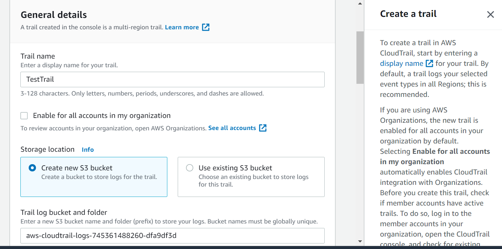
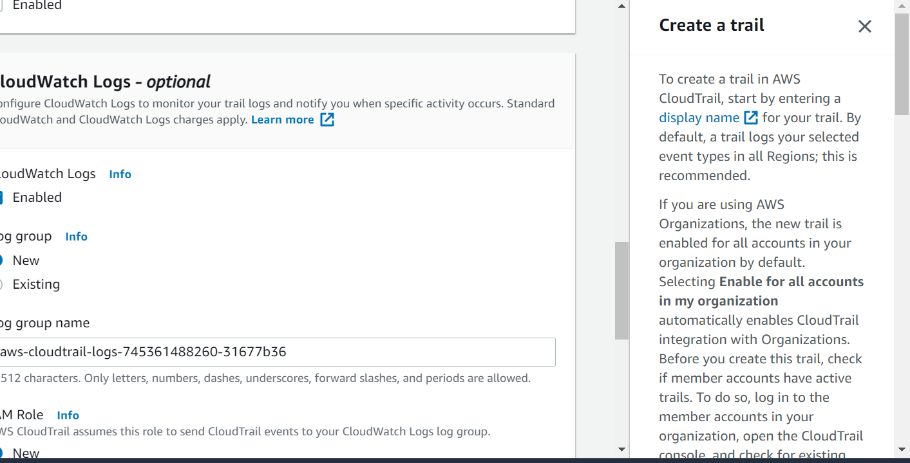

# Security

## CloudTrail

### CloudTrail storage

A trail stored in S3 is required.



 But it is optional to save it in CloudWatch logs.



### CloudTrail events

* Management event
  -  free
  - Can choose write or/and read event
  - Can exclude KMS events
* Data event
  - for S3 and Lambda function
  - Can choose write or/and read event
  - need to pay
* Insight event
  - no option to set 
  - Need to pay

## SSM Parameter Store

### SSM Parameter reference

#### Referencing AWS Secrets Manager secrets

```
/aws/reference/secretsmanager/secret_ID_in_Secrets_Manager
```

Parameter Store, a capability of AWS Systems Manager, is integrated with Secrets Manager so that you can retrieve Secrets Manager secrets when using other AWS services that already support references to Parameter Store parameters. These services include Amazon Elastic Compute Cloud (Amazon EC2), Amazon Elastic Container Service (Amazon ECS), AWS Lambda, AWS CloudFormation, AWS CodeBuild, AWS CodeDeploy, and other Systems Manager capabilities.

**Reference:** 

https://docs.aws.amazon.com/systems-manager/latest/userguide/integration-ps-secretsmanager.html

#### Referencing parameters directly from AWS

```
/aws/service/ami-amazon-linux-latest/amzn2-ami-hvm-x86_64-gp2
```

For example, this one above allows you to retrieve the latest AMI ID of Amazon Linux 2 from AWS.

## AWS Secrets Manager

### Automatic rotation

Automate generation of secrets on rotation by using the build-in Lambda function to update the secrets for RDS, DocumentDB and Redshift. 

For all other rotation, you need to create a Lambda function to enable the rotation. 

**Note:**

SSM Parameter Store has

- no secret rotation, but you can setup CloudEvent to trigger a Lambda function
- no database integration

## SSL/TLS

### HTTPs

HTTPs is the secure version of HTTP, a protocol used between the browse and web server. Technically, HTTPs refers to HTTP over Secure Socket Layer (SSL). HTTPS means all communications between your browse and a web server are encrypted. Behind HTTPs, SSL certificate plays an important role in building trust between a web browse and a web server. By definition, A SSL certificate is a web server's digital certificate, issued by a third party, and verifies the identity of the web server and its public key. 

### How SSL certificate works?

Let's use an example to demonstrate how SSL certificate works?

Here is the scenario, I want to connect to google, and I want all the communications with google server are encrypted.  Here is what happened when I type TTPS:// google.com and hit enter:


**Step 1: Browse sends a request to web server.** My browser requests secure page (HTTPS) from a google web server

**Step 2: Web server sends back SSL certificate and public key.** The google web server send its public key with its SSL certificate, which is digitally signed by a third party, or we call Certificate Authority (CA).

**Step 3: Verify the SSL certificate.** Once my browse get the certificate, it will check the issuer' digital signature to make sure the certificate is valid. As we know, the digital certificate is created by a CA's private key. And my browse is previously installed with many major CA's public keys. Thus, digital signature can be verified. Once the certificate's signature is verified, the digital certificate can be trusted. A green padlock icon appears in the address bar. The green padlock simply indicate the web server's public key really belongs to the web server, not someone else. Verification is done, now it is time to change a secret.

**Step 4: Browse creates symmetric key and encrypted with web server's public key.** My browse create one symmetric key, or a shared secret. It keeps one and gives a copy to the web server. However my browse does not want to send the shared secret in plain text. Therefore, it uses the web server's public key to encrypt the secret and then sends it to the web server. 

**Step 5: Web server decrypts the symmetric key using its own private key.** When the web server gets the encrypted symmetric key, it uses its private key to decrypt it. Now the web server gets the browser's shared key. From now on, all traffic between the client and the web server with be encrypted and decrypted with the same key. 